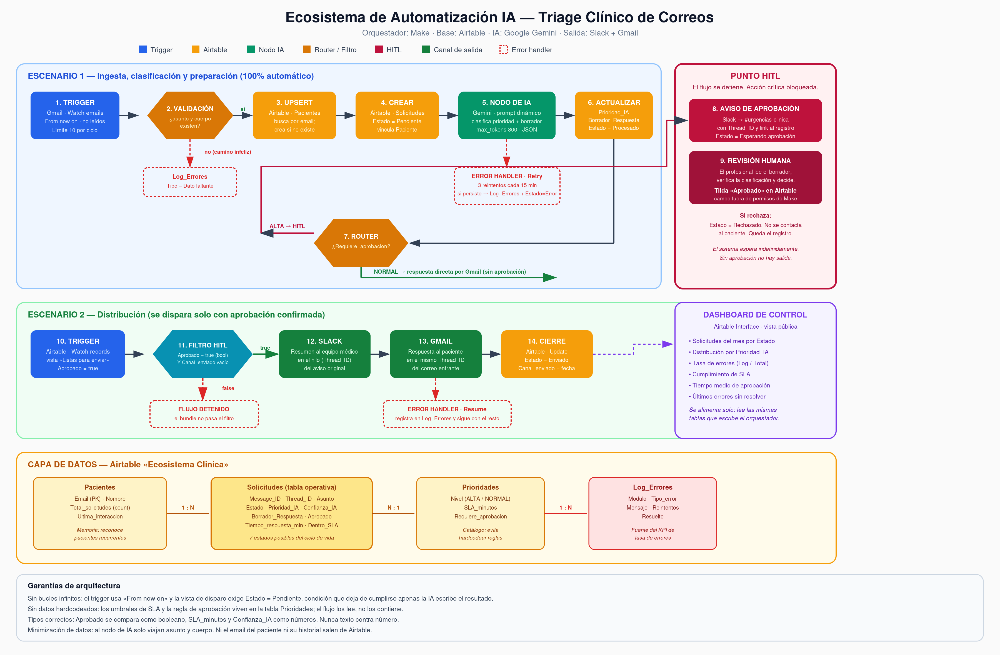

# Ecosistema de Automatización IA — Triage Clínico de Correos

Entrega final del curso de IA. Sistema de automatización end-to-end que recibe
correos de pacientes, los clasifica con IA, los registra en una base de datos y
distribuye la respuesta por el canal adecuado, con un punto obligatorio de
validación humana antes de contactar a un paciente en situación de urgencia.

---

## El problema

Una clínica recibe en una misma casilla urgencias médicas y consultas
administrativas. La recepción está saturada, las urgencias se pierden entre
los pedidos de turno y nadie mide cuánto tarda el equipo en responder.

## La solución

| Categoría | Tecnología | Rol |
|---|---|---|
| Orquestador | **Make** | Dos escenarios encadenados por el estado del registro |
| Base de datos | **Airtable** | Memoria, registro operativo y origen del dashboard |
| Procesamiento IA | **Google Gemini 3 Flash** | Clasifica prioridad y redacta borrador. Salida JSON estructurada |
| Canal de salida | **Slack + Gmail** | Slack para coordinación interna, Gmail para el paciente |

---

## Enlaces

| Recurso | Enlace |
|---|---|
| 📊 **Dashboard de control** (KPIs y tasa de errores) | [airtable.com/app8ZwR78oGBw0XN2/shrXqUc59VdqxVqpP](https://airtable.com/app8ZwR78oGBw0XN2/shrXqUc59VdqxVqpP) |
| 🗃️ **Base de datos** (modo lectura) | [airtable.com/app8ZwR78oGBw0XN2/shr0Yw2N4QDl17Rwn](https://airtable.com/app8ZwR78oGBw0XN2/shr0Yw2N4QDl17Rwn) |
| 📄 **Documentación completa** | [`docs/Entrega_Final_Ecosistema_IA.pdf`](docs/Entrega_Final_Ecosistema_IA.pdf) |

---

## Estado de la integración Make ⚠️

El Escenario 1 (`Ecosistema Clinica — Escenario 1`) está **armado, conectado
y guardado** en Make: los 12 módulos del blueprint
(`blueprints/blueprint_final.json`) más sus error handlers están resueltos a
sus tipos reales de módulo, con conexión activa en Gmail, Airtable y Slack.
La conexión de Airtable se resolvió generando un Personal Access Token desde
una cuenta colaboradora de la base (el correo de verificación de Airtable
nunca llegó a la cuenta principal), y las referencias de campo que habían
quedado apuntando a un módulo de Gmail obsoleto se corrigieron una por una.

**Prueba en vivo pendiente por límite de créditos.** Al ejecutar *Run once*
para la prueba final, Make devolvió *"Scenario is paused (because of
exceeded limits)"*: la cuenta agotó el 100% de los créditos del plan Free
(1.000/1.000) y el reseteo mensual cae fuera de la fecha de entrega. Ya se
enviaron los dos correos de prueba a la casilla monitoreada (uno de
prioridad ALTA y uno NORMAL) y quedan en espera de ser procesados. El
escenario en sí no tiene ningún bloqueo de configuración: en cuanto se
renueve el crédito (o se haga upgrade de plan) va a procesarlos sin cambios
adicionales. Por eso el test de estrés de 5 corridas también quedó
pendiente de esa misma condición.

---

## Contenido del repositorio

```
├── docs/
│   ├── Entrega_Final_Ecosistema_IA.pdf   ← documento principal (5 capítulos)
│   └── arquitectura_final.png            ← diagrama de arquitectura
├── blueprints/
│   ├── blueprint_final.json              ← Escenario 1: ingesta y clasificación
│   └── blueprint_final_escenario2.json   ← Escenario 2: distribución post-HITL
├── datos/
│   └── esquema_airtable.md               ← esquema de las 4 tablas vinculadas
└── evidencias/
    └── ...                               ← capturas de las corridas de prueba
```

---

## Arquitectura



### Escenario 1 — Ingesta y clasificación (automático)

1. **Trigger** — Gmail *Watch emails* con directiva `From now on`, que ignora el
   histórico de la casilla y evita el consumo masivo de operaciones.
2. **Validación** — filtro que descarta correos sin asunto o sin cuerpo.
3. **Upsert Paciente** — busca por email; lo crea si es nuevo, lo reconoce si ya escribió.
4. **Crear Solicitud** — registro en estado `Pendiente`.
5. **Nodo de IA** — Gemini devuelve `{prioridad, confianza, justificacion, borrador}`.
6. **Actualizar** — el resultado se escribe en Airtable.
7. **Router** — deriva según `Requiere_aprobacion` del catálogo de prioridades.

### Punto HITL

Si la prioridad es **ALTA**, el flujo **no contacta a nadie**. Publica un aviso
en Slack con el borrador propuesto y deja el registro en `Esperando aprobación`.

Ahí se detiene indefinidamente, hasta que una persona tilde la casilla
**`Aprobado`** en Airtable. Ese campo está fuera de los permisos de escritura
del token que usa Make: la automatización no puede aprobarse a sí misma.

### Escenario 2 — Distribución (solo con aprobación)

Un filtro exige **cuatro condiciones simultáneas** antes de enviar nada:

```
Aprobado        is true          (booleano, no texto)
Estado          equals           "Aprobado por Humano"
Borrador        exists
Canal_enviado   does not exist   (evita el doble envío)
```

Si alguna falla, el módulo de Gmail no llega a ejecutarse.

---

## Resiliencia

| Punto de fallo | Directiva | Comportamiento |
|---|---|---|
| Correo sin asunto o cuerpo | Filtro | No avanza. No se gasta un token de IA |
| API de IA caída | **Retry** | 3 reintentos cada 15 min; si persiste, `Estado = Error` |
| IA devuelve JSON inválido | Error handler | Corta esa solicitud sin arrastrar al lote |
| Gmail o Slack rechazan el envío | **Resume** | El lote continúa con las demás solicitudes |
| Airtable no responde | Retry + Break | Va a la cola de ejecuciones incompletas |

Todo fallo queda registrado en la tabla `Log_Errores`, que alimenta el KPI de
tasa de errores del dashboard.

---

## Optimización de costos

El criterio no es usar el modelo más barato ni el más capaz, sino asignar a cada
tarea el modelo más chico que la resuelve con calidad suficiente.

| Tarea | Modelo | Modo | Costo mensual |
|---|---|---|---|
| Clasificar prioridad (400 correos/mes) | Gemini 3 Flash / GPT-5-nano | Síncrono | USD 0,08 |
| Auditoría de 500 historiales | Claude Sonnet 5 | Batch + Prompt Caching | USD 11,43 |

**Resultado:** frente a un enfoque ingenuo con Opus 5 en modo síncrono para
todo, el sistema pasa de **USD 850,80** a **USD 138,17 anuales** — un ahorro del
**83,8 %** sin degradar la calidad del análisis.

El detalle de la matriz de decisión y los cálculos está en el capítulo 3 del PDF.

---

## Seguridad

- Al nodo de IA solo viajan asunto, cuerpo y remitente. El historial clínico del
  paciente nunca sale de Airtable.
- Las credenciales viven en las conexiones de Make. En los blueprints publicados
  fueron reemplazadas por marcadores `__GMAIL_CONNECTION__`, `__AIRTABLE_CONNECTION__`
  y `__SLACK_CONNECTION__`.
- El enlace público de la base es de solo lectura; el dashboard expone métricas
  agregadas, no contenido de correos.

---

## Check de seguridad

| Verificación | Estado |
|---|---|
| ¿Filtro contra bucles infinitos? | ✅ `From now on` + vista con `Estado = Pendiente` + `Canal_enviado` vacío |
| ¿Tipos de datos correctos en los filtros? | ✅ `Aprobado` como booleano, `Confianza_IA` y `SLA_minutos` como números |
| ¿Prompt dinámico con variables del sistema? | ✅ inyecta `{{2.subject}}`, `{{2.fromEmail}}`, `{{2.fullTextBody}}` |
| ¿Datos hardcodeados? | ✅ Ninguno. Los umbrales se leen de la tabla `Prioridades` |
| ¿Nodos nombrados? | ✅ Todos, visibles en `metadata.designer.name` |
